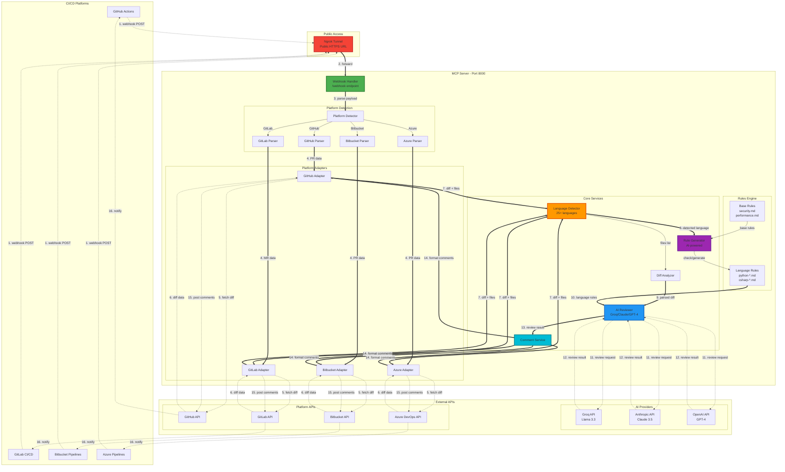
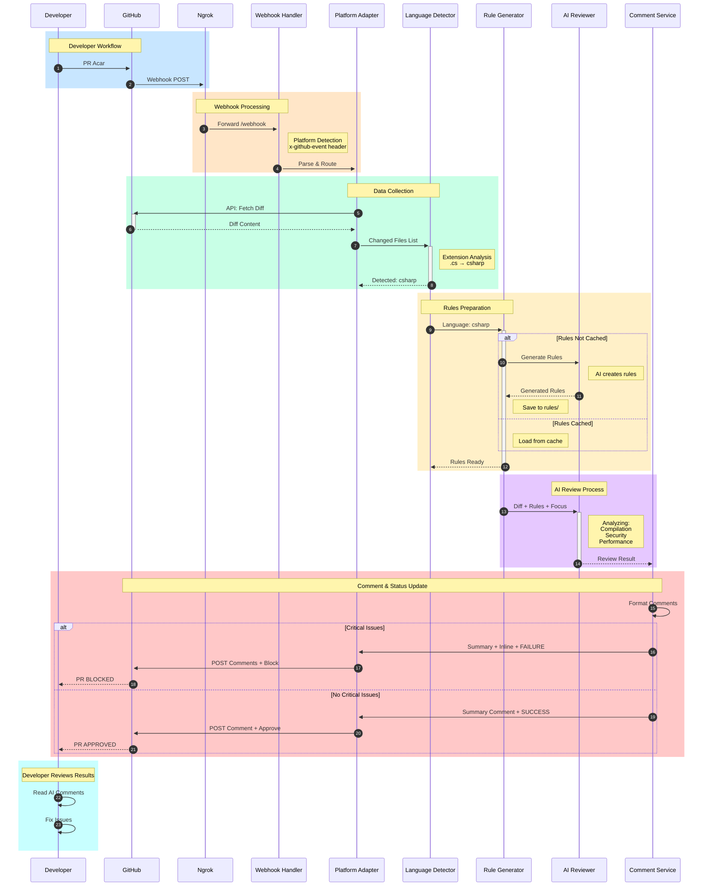
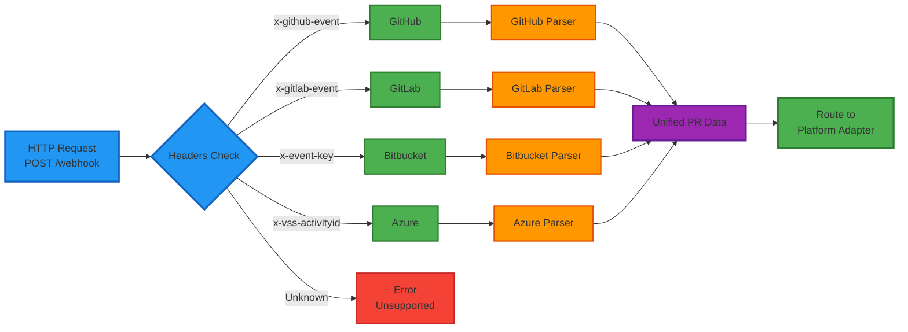
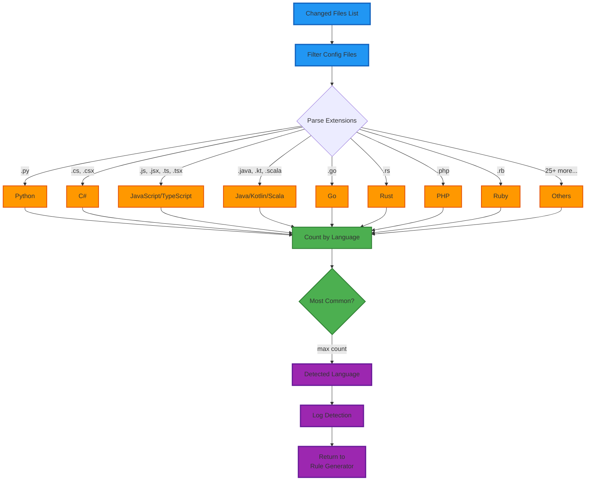
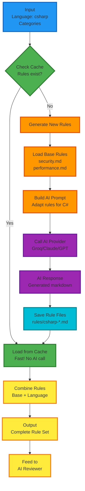
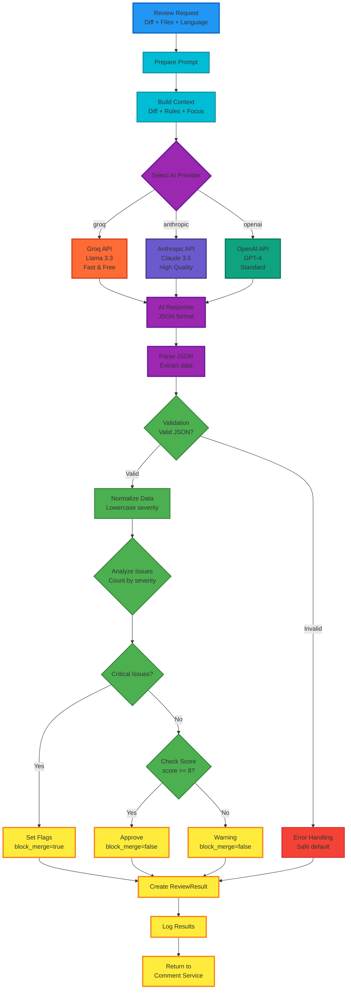
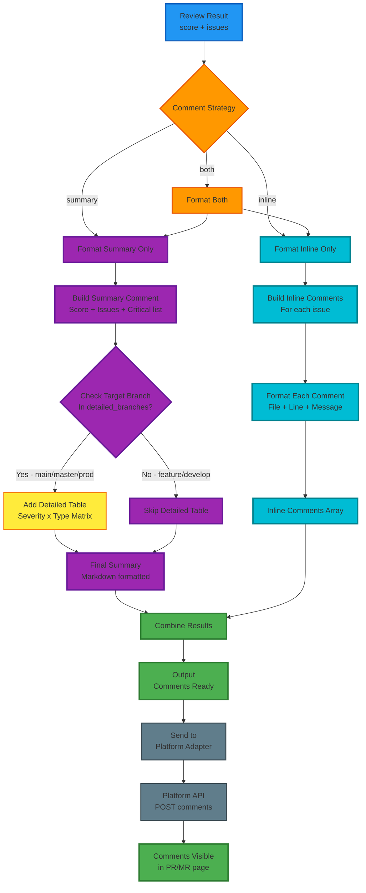

# 🏗️ MCP Code Review Server - Architecture

## 📊 Sistem Mimarisi

### Genel Akış Diyagramı



---

## 🔄 Review Akış Detayı



---

## 🧩 Component Detayları

### 1. Webhook Handler



### 2. Language Detection



### 3. Rule Generator



### 4. AI Reviewer



### 5. Comment Service



---

## 📁 Dosya Yapısı

```
mcp-server/
├── server.py                    # Ana FastAPI server
│
├── config.yaml                  # Konfigürasyon
│
├── webhook/                     # Webhook handling
│   ├── handler.py              # Platform detection
│   └── parsers/
│       ├── github_parser.py    # GitHub webhook parse
│       ├── gitlab_parser.py    # GitLab webhook parse
│       ├── bitbucket_parser.py # Bitbucket webhook parse
│       └── azure_parser.py     # Azure webhook parse
│
├── adapters/                    # Platform integrations
│   ├── base_adapter.py         # Abstract base
│   ├── github_adapter.py       # GitHub API
│   ├── gitlab_adapter.py       # GitLab API
│   ├── bitbucket_adapter.py    # Bitbucket API
│   └── azure_adapter.py        # Azure DevOps API
│
├── services/                    # Core logic
│   ├── language_detector.py   # Dil tespiti
│   ├── diff_analyzer.py        # Diff parsing
│   ├── rule_generator.py       # AI ile rule oluşturma
│   ├── ai_reviewer.py          # AI review engine
│   └── comment_service.py      # Comment formatting
│
├── models/                      # Data models
│   └── schemas.py              # Pydantic models
│
├── rules/                       # Review rules
│   ├── security.md             # Genel security
│   ├── performance.md          # Genel performance
│   ├── compilation.md          # Genel compilation
│   ├── best-practices.md       # Genel best practices
│   ├── csharp-security.md      # C# security (auto-generated)
│   ├── python-performance.md   # Python performance (auto-generated)
│   └── ...                     # Dil-kategori kombinasyonları
│
├── tools/                       # MCP tools
│   └── review_tools.py         # Manual review tools
│
└── docker/                      # Containerization
    ├── Dockerfile
    └── docker-compose.yml
```

---

## 📊 Veri Akışı

```
PR Açılır
    ↓
Webhook Gelir (JSON payload)
    ↓
Platform Tespit Edilir (headers)
    ↓
PR Verisi Parse Edilir (parser)
    ↓
Diff API'den Çekilir (adapter)
    ↓
Dosyalar Listelenir (diff analyzer)
    ↓
Dil Tespit Edilir (language detector)
    ↓
Rule'lar Hazırlanır (rule generator)
    ├─ Cache'de var mı? → Yükle
    └─ Yok mu? → AI ile oluştur → Kaydet
    ↓
AI'a Gönderilir (ai reviewer)
    ├─ Diff
    ├─ Language-specific rules
    └─ Focus areas
    ↓
Review Sonucu Alınır (JSON)
    ├─ Score (0-10)
    ├─ Issues (severity, line, file)
    └─ Block merge? (critical varsa true)
    ↓
Yorumlar Formatlanır (comment service)
    ├─ Summary comment
    └─ Inline comments
    ↓
Platform'a Yazılır (adapter)
    ├─ Post comments (API)
    └─ Update status (success/failure)
    ↓
Developer Görür (PR sayfası)
```

---

## 🎯 Kritik Bileşenler

### 1. Platform Agnostic Design
- Tek webhook endpoint tüm platformları destekler
- Header-based platform detection
- Unified PR data model

### 2. Language-Aware Review
- 25+ dil desteği
- Otomatik dil tespiti
- Dile özel kurallar (AI-generated)

### 3. Intelligent Caching
- Language rules cache
- Mevcut rule varsa yeniden oluşturulmaz
- Performans optimizasyonu

### 4. Flexible AI Provider
- Groq (hızlı, ücretsiz)
- Anthropic Claude (kaliteli)
- OpenAI GPT-4 (standart)
- Runtime'da değiştirilebilir

### 5. Smart Comment Strategy
- Summary: Genel özet
- Inline: Satır bazlı yorumlar
- Both: Her ikisi de
- Branch-specific detailed tables

---

**🎨 Architecture by Design:**
- ✅ **Modular**: Her component bağımsız
- ✅ **Scalable**: Yeni platform ekleme kolay
- ✅ **Maintainable**: Temiz kod yapısı
- ✅ **Testable**: Unit test friendly
- ✅ **Flexible**: Config-driven behavior
