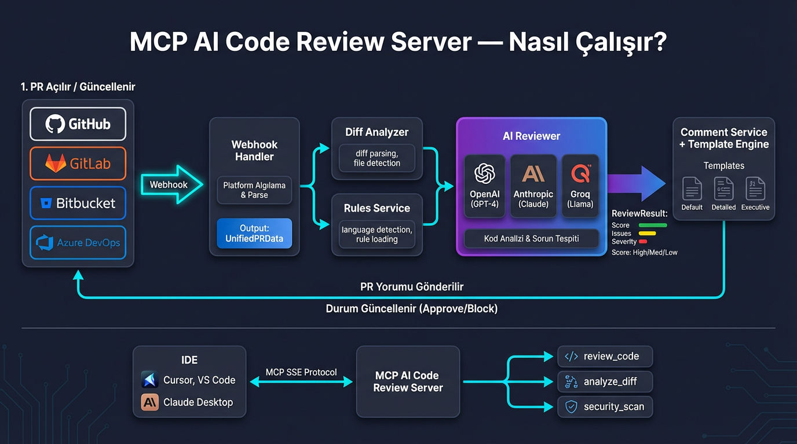

# MCP AI Code Review Server — Teknik Sunum

> **Proje:** MCP AI Code Review Server  
> **Versiyon:** 1.0.0  
> **Geliştirici:** Mennano  
> **Tarih:** Şubat 2026  
> **Sunum Formatı:** NotebookLM / PowerPoint uyumlu — her bölüm bir slayta karşılık gelir

---

## SLAYT 1: Kapak

### MCP AI Code Review Server

**Yapay Zeka Destekli, Platform-Bağımsız Otomatik Kod İnceleme Sistemi**

- 4 Platform: GitHub · GitLab · Bitbucket · Azure DevOps
- 3 AI Provider: OpenAI (GPT-4) · Anthropic (Claude 3.5) · Groq (Llama 3.3)
- 25+ Programlama Dili Desteği
- MCP Protokolü ile IDE Entegrasyonu
- AI ile Otomatik Rule Üretimi
- Modüler Template Sistemi ile Özelleştirilebilir PR Yorumları
- Self-Hosted, Açık Kaynak, Tam Kontrol

---

## SLAYT 2: Neden Bu Projeye İhtiyaç Var?

### Problem Tanımı

Yazılım geliştirme sürecinde Pull Request (PR) inceleme aşaması kritik bir kalite kontrol mekanizmasıdır. Ancak mevcut durumda ciddi sorunlar yaşanmaktadır:

| Problem | Etki | Maliyet |
|---------|------|---------|
| Manuel kod inceleme çok zaman alıyor | Geliştirici 2-4 saat/gün review'a harcıyor | Üretkenlik kaybı |
| İnsan gözü her hatayı yakalayamıyor | Compilation hataları, güvenlik açıkları kaçıyor | Prodüksiyon hataları |
| Farklı platformlarda farklı araçlar | GitHub'da bir araç, Bitbucket'ta başka | Araç maliyeti + eğitim |
| Tutarsız review kalitesi | Reviewer'a göre değişen standartlar | Kod kalitesi düşüşü |
| Mevcut çözümler pahalı | CodeRabbit: $12-24/kullanıcı/ay | Yüksek lisans maliyeti |
| Mevcut çözümler kısıtlı | Platform bağımlı, özelleştirme zor | Vendor lock-in |
| Veri gizliliği endişesi | Kod 3. parti sunuculara gidiyor | Compliance riski |
| Kural/standart güncellemeleri manuel | Her güncelleme tüm ekibe bildirim gerektiriyor | Operasyonel yük |

### Hedefimiz

Tek bir webhook endpoint'i ile tüm platformlardan gelen PR'ları otomatik, tutarlı ve düşük maliyetle inceleyen, şirket standartlarına göre tamamen özelleştirilebilir, self-hosted bir çözüm üretmek.

---

## SLAYT 3: Neden Python?

### Teknoloji Seçimi Gerekçesi

Python'ın bu proje için tercih edilmesinin somut teknik nedenleri:

**1. AI/ML Ekosisteminin Merkezi**
- OpenAI, Anthropic ve Groq'un resmi SDK'ları Python-first
- `openai>=1.3.0`, `anthropic>=0.7.0`, `groq>=0.4.0` — tüm SDK'lar production-ready
- AI provider'lar arasında geçiş tek satır config değişikliğiyle mümkün
- Yeni AI provider'lar (Google Gemini, Mistral, vb.) eklemek saatler alıyor, günler değil

**2. Hızlı Prototipleme ve Yüksek Verimlilik**
- FastAPI ile dakikalar içinde production-ready REST API
- Pydantic v2 ile tip güvenliği + otomatik validation
- `async/await` ile native asynchronous I/O — webhook'lar eşzamanlı işlenir
- Aynı işlevsellik C#/.NET'te 3-4 kat daha fazla kod gerektirir

**3. Platform API Kütüphaneleri**
- `PyGithub` → GitHub REST API
- `python-gitlab` → GitLab REST API
- `atlassian-python-api` → Bitbucket REST API
- `azure-devops` → Azure DevOps REST API
- Tüm platform entegrasyonları mature, well-documented Python kütüphaneleri

**4. MCP (Model Context Protocol) Desteği**
- MCP'nin resmi Python SDK'sı aktif olarak geliştirilmekte
- IDE entegrasyonu (Claude Desktop, Cursor, VS Code) için MCP Python SDK doğrudan kullanılıyor
- SSE (Server-Sent Events) transport desteği built-in

**5. Diff Parsing ve Metin İşleme**
- `unidiff` kütüphanesi ile git diff parsing
- Python'un güçlü string manipulation yetenekleri
- Regex, template rendering, markdown işleme natively kolay

**6. DevOps ve Deployment Kolaylığı**
- Docker image boyutu: ~150MB (python:3.11-slim base)
- `pip install -r requirements.txt` ile tam dependency yönetimi
- Railway, Heroku, AWS Lambda gibi PaaS platformlarına dakikalar içinde deploy
- CI/CD pipeline'larla sorunsuz entegrasyon

**7. Ekip Uyumluluğu ve Bakım**
- Okunabilir, temiz syntax — yeni ekip üyeleri hızla adapte olur
- Zengin test ekosistemi (pytest, unittest)
- `structlog` ile structured JSON logging — production monitoring kolaylığı

### Alternatif Karşılaştırma

| Kriter | Python | Node.js | C#/.NET | Go |
|--------|--------|---------|---------|-----|
| AI SDK Olgunluğu | ⭐⭐⭐⭐⭐ | ⭐⭐⭐ | ⭐⭐ | ⭐⭐ |
| Platform API Kütüphaneleri | ⭐⭐⭐⭐⭐ | ⭐⭐⭐ | ⭐⭐⭐ | ⭐⭐ |
| Geliştirme Hızı | ⭐⭐⭐⭐⭐ | ⭐⭐⭐⭐ | ⭐⭐⭐ | ⭐⭐⭐ |
| MCP SDK Desteği | ⭐⭐⭐⭐⭐ | ⭐⭐⭐⭐ | ⭐⭐ | ⭐ |
| Async I/O | ⭐⭐⭐⭐ | ⭐⭐⭐⭐⭐ | ⭐⭐⭐⭐ | ⭐⭐⭐⭐⭐ |
| Deployment Kolaylığı | ⭐⭐⭐⭐⭐ | ⭐⭐⭐⭐ | ⭐⭐⭐ | ⭐⭐⭐⭐ |
| Topluluk & Ekosistem (AI) | ⭐⭐⭐⭐⭐ | ⭐⭐⭐ | ⭐⭐⭐ | ⭐⭐ |

**Sonuç:** AI-first bir projenin doğal dili Python'dır. SDK desteği, ekosistem zenginliği ve geliştirme hızı açısından açık ara öndedir.

---

## SLAYT 4: Projenin Temelleri — Mimari Genel Bakış

### Sistem Mimarisi

```
┌─────────────────────────────────────────────────────────────────────────┐
│                     MCP AI Code Review Server                           │
├─────────────────────────────────────────────────────────────────────────┤
│                                                                         │
│  ┌────────────┐    ┌───────────────┐    ┌─────────────────────────┐     │
│  │  Webhook   │───▶│   Platform    │───▶│     AI Review Engine    │     │
│  │  Handler   │    │  Detection    │    │                         │     │
│  │            │    │  (Auto)       │    │  ┌───────────────────┐  │     │
│  └────────────┘    └───────────────┘    │  │ Provider Router   │  │     │
│       ▲                                 │  │                   │  │     │
│       │            ┌───────────────┐    │  │ ┌─────┐ ┌──────┐ │  │     │
│  ┌────┴───────┐    │   Language    │    │  │ │Groq │ │OpenAI│ │  │     │
│  │  Platform  │    │   Detector   │───▶│  │ ├─────┤ ├──────┤ │  │     │
│  │  Parsers   │    │   (25+ dil)  │    │  │ │Anthr│ │ Mock │ │  │     │
│  │            │    └───────────────┘    │  │ └─────┘ └──────┘ │  │     │
│  │ ┌────────┐ │                         │  └───────────────────┘  │     │
│  │ │GitHub  │ │    ┌───────────────┐    │                         │     │
│  │ ├────────┤ │    │ Rules Helper  │───▶│  Rules + AI Prompt      │     │
│  │ │GitLab  │ │    │ (MD→Context)  │    │                         │     │
│  │ ├────────┤ │    └───────────────┘    └─────────────────────────┘     │
│  │ │Bitbckt │ │                                    │                    │
│  │ ├────────┤ │    ┌───────────────┐               ▼                    │
│  │ │Azure   │ │    │ Rule          │    ┌─────────────────────────┐     │
│  │ └────────┘ │    │ Generator     │    │    Comment Service      │     │
│  └────────────┘    │ (AI-powered)  │    │  ┌───────────────────┐  │     │
│                    └───────────────┘    │  │ Template Engine   │  │     │
│  ┌────────────┐                         │  │ Default/Detailed/ │  │     │
│  │  MCP Tools │    ┌───────────────┐    │  │ Executive/Custom  │  │     │
│  │  (SSE)     │    │ Diff Analyzer │    │  └───────────────────┘  │     │
│  │            │    │ (unidiff)     │    └─────────────────────────┘     │
│  │ review_code│    └───────────────┘               │                    │
│  │ analyze_dif│                                    ▼                    │
│  │ sec_scan   │                         ┌─────────────────────────┐     │
│  └────────────┘                         │  Platform Adapters      │     │
│                                         │  (Yorum + Status Post)  │     │
│                                         └─────────────────────────┘     │
├─────────────────────────────────────────────────────────────────────────┤
│  FastAPI Server │ MCP/SSE │ Docker/Podman │ Structured Logging (JSON) │
└─────────────────────────────────────────────────────────────────────────┘
```

### Temel Tasarım İlkeleri

| İlke | Uygulama |
|------|----------|
| **Platform Agnostik** | Tek webhook endpoint, otomatik platform tespiti |
| **Provider Agnostik** | Abstract AI interface, factory pattern ile provider seçimi |
| **Modüler Mimari** | Her bileşen bağımsız, değiştirilebilir, test edilebilir |
| **Config-Driven** | Tüm davranışlar `config.yaml` ile yönetilir, kod değişikliği gerektirmez |
| **Self-Hosted** | Tüm veriler şirket kontrolünde, 3. parti bağımlılığı yok |

---

## SLAYT 5: Review Akışı — Uçtan Uca

### Akış Diyagramı



### PR Review Lifecycle (5 Adım)

```
┌──────────────┐     ┌──────────────┐     ┌──────────────┐
│  1. WEBHOOK  │────▶│  2. DIFF     │────▶│  3. AI       │
│  ALINDI      │     │  ÇEKİLDİ     │     │  İNCELEME    │
│              │     │              │     │              │
│ Platform     │     │ Adapter ile  │     │ Dil Tespiti  │
│ Tespiti      │     │ API'den diff │     │ Rule Yükleme │
│ (Header)     │     │ çekilir      │     │ AI Prompt    │
└──────────────┘     └──────────────┘     └──────────────┘
                                                │
┌──────────────┐     ┌──────────────┐           │
│  5. STATUS   │◀────│  4. YORUM    │◀──────────┘
│  GÜNCELLEME  │     │  GÖNDERİMİ   │
│              │     │              │
│ success /    │     │ Summary +    │
│ failure      │     │ Inline       │
│ (auto block) │     │ (Template)   │
└──────────────┘     └──────────────┘
```

---

### Sunum Konuşma Notları (Akış Diyagramı Anlatımı)

> Aşağıdaki notlar, diyagramı sunarken kullanılacak konuşma metnidir.
> Her bölüm görseldeki ilgili alana karşılık gelir.

---

**[GİRİŞ — Diyagramı Göster]**

> "Şimdi sistemin nasıl çalıştığına bakalım. Bu diyagram, bir PR açıldığı andan yorumun platforma yazıldığı ana kadar olan tüm süreci gösteriyor. Diyagramda iki ana akış var: üstte webhook tabanlı otomatik review akışı, altta ise IDE üzerinden doğrudan kullanım."

---

**[SOL TARAF — Platform Tetikleyicileri]**

> "Süreç en soldan başlıyor. Bir geliştirici GitHub'da, GitLab'da, Bitbucket'ta veya Azure DevOps'ta bir Pull Request açtığında ya da güncellediğinde, platform otomatik olarak bizim sunucuya bir **webhook** gönderir."
>
> "Buradaki kritik nokta şu: dört farklı platform, tek bir webhook endpoint'i kullanıyor. Yani `/webhook` adresine gelen isteğin hangi platformdan geldiğini sistem kendisi anlıyor. GitHub, GitLab, Bitbucket, Azure — hepsinden gelen istekler aynı kapıdan giriyor."

---

**[WEBHOOK HANDLER — Platform Algılama]**

> "Gelen webhook isteği **Webhook Handler** bileşenine ulaşıyor. Bu bileşen HTTP header'larına bakarak platformu otomatik tespit ediyor. Örneğin GitHub `X-GitHub-Event` header'ı gönderir, GitLab `X-Gitlab-Event` kullanır."
>
> "Platform tespit edildikten sonra, platforma özel **parser** devreye girer. GitHub'ın gönderdiği JSON yapısı ile Bitbucket'ınki tamamen farklı — parser'lar bu farklı formatları alıp hepsini **UnifiedPRData** adında tek bir ortak modele dönüştürür. Böylece sistemin geri kalanı hangi platformdan geldiğini bilmek zorunda kalmaz."

---

**[ORTADAKI İKİ KUTU — Diff Analyzer & Rules Service]**

> "Ortak model oluştuktan sonra iki bileşen **paralel** olarak çalışmaya başlar:"
>
> "**Diff Analyzer** — Platform adapter'ı üzerinden PR'ın diff'ini API ile çeker. Hangi dosyalar değişmiş, kaç satır eklenmiş, kaç satır silinmiş — bunları analiz eder. Mesela bir PR'da 4 dosyanın değiştiğini, toplam 120 satır eklendiğini tespit eder."
>
> "**Rules Service** — Değişen dosyaların uzantılarına bakarak programlama dilini otomatik tespit eder. `.cs` dosyası varsa C#, `.py` varsa Python, `.go` varsa Go olarak algılar. Sonra o dile özel kuralları yükler. Mesela C# için `csharp-compilation.md`, `csharp-security.md` gibi kural dosyaları devreye girer. Bu kurallar, AI'ın neye dikkat edeceğini belirler."

---

**[MOR KUTU — AI Reviewer]**

> "Burası sistemin kalbi. **AI Reviewer** bileşeni, diff'i ve kuralları alıp yapay zekaya gönderir."
>
> "Üç farklı AI sağlayıcıyı destekliyoruz: **OpenAI** (GPT-4), **Anthropic** (Claude) ve **Groq** (Llama). Config dosyasından hangisinin kullanılacağı seçilebilir. Biri başarısız olursa otomatik olarak diğerine geçebilir — buna **fallback** mekanizması diyoruz."
>
> "AI, kodu satır satır inceleyip şu çıktıyı üretir:"
> - "**Score:** 0-10 arası bir kalite puanı"
> - "**Issues:** Tespit edilen sorunların listesi — her birinin severity'si (critical, high, medium, low), açıklaması, dosya yolu ve satır numarası var"
> - "**block_merge:** Kritik hata varsa merge'ün engellenmesi önerisi"
>
> "Önemli bir özellik daha var: **Short-Circuit mekanizması**. Eğer AI, kodun derlenmeyeceğini fark ederse (syntax hatası, eksik `await`, tip uyumsuzluğu gibi), diğer kategorileri kontrol etmeden durur. Çünkü derlenmeyen kodda güvenlik veya performans analizi yapmanın anlamı yok."

---

**[SAĞ TARAF — Comment Service & Template Engine]**

> "AI'dan gelen sonuçlar **Comment Service** bileşenine aktarılır. Burada **Template Engine** devreye girer."
>
> "Üç hazır şablon var:"
> - "**Default** — Kompakt, kısa özet. Küçük PR'lar için ideal."
> - "**Detailed** — Her sorun ayrıntılı açıklanır, kod önerileri dahil. Geliştirici odaklı."
> - "**Executive** — Yönetici bakış açısı. Skor, risk seviyesi, approval durumu ön planda."
>
> "Ayrıca `custom_templates/` klasörüne kendi Markdown şablonunuzu koyarak tamamen özel format da oluşturabilirsiniz. Şablon seçimi config'den yapılır, runtime'da API ile de değiştirilebilir."

---

**[GERİ OK — Platforma Dönüş]**

> "Formatlanan yorum, geldiği platforma geri gönderilir. PR'a bir **summary comment** olarak eklenir. Config'e göre satır bazlı **inline comment'ler** de eklenebilir."
>
> "Son olarak PR'ın **status'u** güncellenir:"
> - "Kritik sorun varsa → **failure** — merge otomatik engellenir"
> - "Skor 8 veya üstüyse → **success** — onay verilir"
> - "Aradaysa → **success** ama 'review needed' notu eklenir"
>
> "Yani geliştirici PR açar, birkaç saniye içinde AI review yorumu PR'a düşer. Manuel bir işlem yok."

---

**[ALT BÖLÜM — MCP IDE Entegrasyonu]**

> "Diyagramın alt kısmında farklı bir kullanım senaryosu var: **IDE entegrasyonu**."
>
> "Cursor, VS Code veya Claude Desktop gibi IDE'ler, **MCP SSE protokolü** üzerinden doğrudan sunucuya bağlanabiliyor. Webhook'a gerek yok — geliştirici IDE'nin içinden üç araç kullanabiliyor:"
> - "**review_code** — Seçili kodu AI'a review ettirmek"
> - "**analyze_diff** — Bir diff'i analiz etmek"
> - "**security_scan** — Güvenlik taraması yapmak"
>
> "Bu sayede PR açmadan önce bile kodunuzu kontrol edebilirsiniz. Bir nevi 'pre-review' imkanı."

---

**[KAPANIŞ]**

> "Özetlersek: Sistem tamamen otomasyona dayalı. PR açılır → webhook gelir → diff çekilir → AI inceler → yorum yazılır → durum güncellenir. Geliştirici hiçbir ekstra adım atmadan, saniyeler içinde AI destekli kod inceleme raporu alır. Üstelik hangi platformu kullanırsanız kullanın, aynı kalitede ve aynı formatta."

---

**Detaylı Akış (Teknik Referans):**

1. **Webhook Alımı** — Platform bir PR açıldığında/güncellendiğinde webhook gönderir
   - GitHub: `X-GitHub-Event: pull_request`
   - GitLab: `X-Gitlab-Event: Merge Request Hook`
   - Bitbucket: `X-Event-Key: pullrequest:created`
   - Azure DevOps: `X-VSS-ActivityId` header
   - Fallback: Payload yapısından otomatik tespit

2. **Diff Çekme** — İlgili platform adapter'ı ile PR diff'i API üzerinden çekilir
   - `unidiff` kütüphanesi ile parse edilir
   - Değişen dosyalar, eklenen/silinen satırlar çıkarılır

3. **AI İnceleme** — Tespit edilen dile göre kurallar yüklenir, AI'a prompt gönderilir
   - Dil tespiti (file extension analizi)
   - Dile özel + genel rule'lar prompt'a eklenir
   - AI provider seçimi (config'den veya override)
   - JSON formatında yapılandırılmış yanıt alınır

4. **Yorum Gönderimi** — Seçilen template ile formatlanıp PR'a yorum olarak eklenir
   - Summary comment (genel değerlendirme)
   - Inline comments (satır bazlı notlar)
   - Template sistemi ile özelleştirilebilir format

5. **Status Güncelleme** — PR'ın commit status'u güncellenir
   - Critical sorun varsa → `failure` (merge engellenir)
   - Score >= 8 → `success`
   - Arada → `success` (review needed notu ile)

---

## SLAYT 6: Desteklenen Platformlar

### 4 Büyük Platform, Tek Webhook Endpoint

| Platform | Adapter | Parser | CI/CD Entegrasyonu | Auth Yöntemi | Durum |
|----------|---------|--------|--------------------|-------------|-------|
| **GitHub** | `GitHubAdapter` | `GitHubParser` | GitHub Actions | Bearer Token | ✅ Aktif |
| **GitLab** | `GitLabAdapter` | `GitLabParser` | GitLab CI/CD | Private Token | ✅ Aktif |
| **Bitbucket** | `BitbucketAdapter` | `BitbucketParser` | Bitbucket Pipelines | App Password (Basic Auth) | ✅ Aktif |
| **Azure DevOps** | `AzureAdapter` | `AzureParser` | Azure Pipelines | PAT (Personal Access Token) | ✅ Aktif |

### Platform Tespiti — Otomatik Header Algılama

```python
PLATFORM_HEADERS = {
    'x-github-event':    Platform.GITHUB,
    'x-gitlab-event':    Platform.GITLAB,
    'x-event-key':       Platform.BITBUCKET,
    'x-vss-activityid':  Platform.AZURE,
}
```

Header bulunamazsa **payload yapısından** da tespit yapabilir (fallback mekanizması). Böylece aynı `/webhook` endpoint'i tüm platformlar için çalışır.

### Her Platform İçin Tam Özellik Seti

| Özellik | GitHub | GitLab | Bitbucket | Azure DevOps |
|---------|--------|--------|-----------|-------------|
| Diff çekme | ✅ | ✅ | ✅ | ✅ |
| Summary yorum | ✅ | ✅ | ✅ | ✅ |
| Inline yorum | ✅ | ✅ | ✅ | ✅ |
| Status güncelleme | ✅ | ✅ | ✅ | ✅ |
| Merge bloklama | ✅ | ✅ | ✅ | ✅ |

### Adapter Mimarisi

Tüm adapter'lar `BasePlatformAdapter` abstract sınıfından türer:

```python
class BasePlatformAdapter(ABC):
    async def fetch_diff(self, pr_data: UnifiedPRData) -> str: ...
    async def post_summary_comment(self, pr_data: UnifiedPRData, comment: str): ...
    async def post_inline_comments(self, pr_data: UnifiedPRData, comments: list): ...
    async def update_status(self, pr_data: UnifiedPRData, state: str, description: str): ...
```

Yeni bir platform eklemek = Sadece yeni bir adapter yazmak. Mevcut iş mantığı hiç değişmez.

---

## SLAYT 7: AI Provider Sistemi

### 3 AI Provider — Modüler ve Değiştirilebilir

| Provider | Model(ler) | Hız | Maliyet | Öne Çıkan Kullanım |
|----------|-----------|-----|---------|---------------------|
| **Groq** | Llama 3.3 70B Versatile, Llama 3.1 70B, Mixtral 8x7B | ⚡ Çok Hızlı | 💰 Ücretsiz/Düşük | Yüksek hacimli günlük review |
| **OpenAI** | GPT-4 Turbo, GPT-4o, GPT-4o-mini | 🔄 Orta | 💰💰 Orta | Karmaşık kod analizi |
| **Anthropic** | Claude 3.5 Sonnet | 🔄 Orta | 💰💰💰 Orta-Yüksek | Detaylı güvenlik analizi |

### Provider-Agnostic Mimari

Sistem, AI provider'lardan tamamen soyutlanmıştır. `AIProvider` abstract base class'ı tüm provider'lar için ortak arayüzü tanımlar:

```python
class AIProvider(ABC):
    name: str

    @abstractmethod
    def default_model(self) -> str: ...

    @abstractmethod
    def chat(self, req: ChatRequest) -> str: ...
```

Her provider (`GroqProvider`, `OpenAIProvider`, `AnthropicProvider`) bu interface'i implemente eder. Factory pattern ile isimden instance oluşturulur:

```python
provider = create_provider("groq", config)
```

### AIProviderRouter — Akıllı Yönlendirme

Router, config'deki ayarlara göre doğru provider ve modeli seçer:

```python
class AIProviderRouter:
    def resolve(self, provider_override=None, model_override=None) -> SelectedProvider: ...
    def chat(self, system, user, provider_override=None, model_override=None) -> (name, model, text): ...
```

**Legacy config (tek provider):**
```yaml
ai:
  provider: "groq"
  model: "llama-3.3-70b-versatile"
  temperature: 0.3
  max_tokens: 4096
```

**Yeni config (çoklu provider):**
```yaml
ai:
  temperature: 0.3
  max_tokens: 4096
  providers:
    - name: groq
      model: llama-3.3-70b-versatile
    - name: openai
      model: gpt-4o-mini
  primary: groq
```

**Provider değiştirmek = config'de tek satır değişikliği.** Kod hiç değişmez.

### MCP Tool Seviyesinde Override

MCP tool çağrısında provider ve model runtime'da override edilebilir:

```json
{
  "code": "def login(user, pwd): ...",
  "provider": "openai",
  "model": "gpt-4o",
  "focus": ["security"]
}
```

---

## SLAYT 8: Dil Tespiti ve Çoklu Dil Desteği

### 25+ Programlama Dili Otomatik Tespiti

| Dil Ailesi | Desteklenen Diller | Uzantılar |
|------------|-------------------|-----------|
| **.NET** | C# | `.cs`, `.csx` |
| **JVM** | Java, Kotlin, Scala | `.java`, `.kt`, `.scala` |
| **Web Frontend** | JavaScript, TypeScript | `.js`, `.jsx`, `.ts`, `.tsx`, `.mjs` |
| **Scripting** | Python, Ruby, PHP | `.py`, `.rb`, `.php` |
| **Sistem** | Go, Rust, C, C++ | `.go`, `.rs`, `.c`, `.cpp`, `.h` |
| **Mobil** | Swift, Dart | `.swift`, `.dart` |
| **Shell** | Shell, PowerShell | `.sh`, `.bash`, `.ps1` |
| **Data** | SQL, YAML, JSON, XML | `.sql`, `.yaml`, `.json`, `.xml` |
| **Markup** | HTML, CSS/SCSS | `.html`, `.css`, `.scss` |

### Nasıl Çalışır?

1. PR'daki değişen dosya listesi alınır (örn: `auth.cs`, `user.cs`, `config.json`)
2. File extension'lar sayılır (`Counter` ile: `.cs` → 2, `.json` → 1)
3. En çok kullanılan dil seçilir (örn: **C#**)
4. Config dosyaları (`package.json`, `Dockerfile`, vb.) false positive önleme amacıyla filtrelenir

```python
detected_language = LanguageDetector.detect_from_files(files_changed)
# Örnek: 5 adet .cs + 2 adet .json → Sonuç: "csharp"
```

### Dil Tespiti Neden Önemli?

- Dile özel **rule dosyaları** yüklenir (`csharp-security.md`, `python-compilation.md`)
- AI prompt'una **dil bağlamı** eklenir
- **False positive** azalır (C# kuralları Python koduna uygulanmaz)
- Mevcut olmayan dil kuralları **AI ile otomatik oluşturulur** (RuleGenerator)

---

## SLAYT 9: Rule Sistemi — AI ile Otomatik Kural Üretimi

### Markdown Tabanlı Kural Yönetimi

Rule sistemi, kod review kurallarını `.md` dosyaları olarak saklar. Bu dosyalar AI prompt'una bağlam olarak eklenir.

**Mevcut Rule Kategorileri:**

| Kategori | Dosya | Öncelik | İçerik Özeti |
|----------|-------|---------|-------------|
| Compilation | `compilation.md` | 🔴 CRITICAL | Syntax/type hataları, eksik keyword'ler, derleme sorunları |
| Security | `security.md` | 🔴 CRITICAL | SQL injection, XSS, CSRF, exposed secrets |
| Performance | `performance.md` | 🟡 MEDIUM | N+1 query, gereksiz loop, memory leak |
| Best Practices | `best-practices.md` | 🔵 LOW | Clean code, SOLID, naming conventions |
| .NET Fundamentals | `dotnet-fundamentals.md` | 🟠 HIGH | Entity Framework, async/await, LINQ |
| Linter | `linter.md` | 🔵 LOW | Formatting, stil kuralları |

### Dile Özel Kurallar — Otomatik Üretim

Her genel kural kategorisi için dile özel versiyonlar bulunur veya otomatik oluşturulur:

```
rules/
├── compilation.md              # Genel compilation kuralları
├── security.md                 # Genel güvenlik kuralları
├── performance.md              # Genel performans kuralları
├── best-practices.md           # Genel best practices
│
├── csharp-compilation.md       # C# özel compilation kuralları
├── csharp-security.md          # C# özel güvenlik kuralları
├── csharp-performance.md       # C# özel performans kuralları
├── csharp-best-practices.md    # C# özel best practices
│
├── python-compilation.md       # Python özel kuralları
├── python-security.md
├── python-performance.md
├── python-best-practices.md
│
├── go-compilation.md           # Go özel kuralları
├── go-security.md
├── go-performance.md
└── go-best-practices.md
```

**Toplam: 18+ rule dosyası, Git ile versiyonlanır**

### AI ile Otomatik Rule Üretimi (RuleGenerator)

Yeni bir dil için rule bulunmadığında, sistem AI ile otomatik oluşturur:

```
1. PR gelir → 2. Dil tespiti (örn: Rust)
      │
      ▼
3. rust-security.md mevcut mu?
      │
      ├── EVET → Direkt yükle, AI prompt'a ekle
      │
      └── HAYIR → RuleGenerator devreye girer:
                     │
                     ▼
                4. Genel security.md şablonunu al
                5. Rust diline özel olarak AI ile revize et
                6. rust-security.md olarak kaydet
                7. Bir sonraki review'da hazır
```

### RulesHelper — Kural Yönetim Modülü

`RulesHelper` sınıfı, rule dosyalarını yerel dosya sisteminden okur ve çözümler:

```python
class RulesHelper:
    def list_rules(language=None, category=None) -> list  # Mevcut rule'ları listele
    def get_rule(filename) -> str | None                  # Belirli rule içeriğini oku
    def resolve_rules(focus_areas, language=None) -> dict  # Odak alanlarına göre rule çözümleme
```

Rule'lar API endpoint'leri ile de sorgulanabilir:

| Endpoint | Açıklama |
|----------|----------|
| `GET /rules` | Tüm rule dosyalarını listele |
| `GET /rules?language=csharp` | Dile göre filtrele |
| `GET /rules/resolve?focus=security&language=python` | Odak alanı + dil çözümle |
| `GET /rules/{filename}` | Belirli rule içeriğini getir |

---

## SLAYT 10: Short-Circuit Review — Akıllı Önceliklendirme

### Compilation Hatası Bulunursa Diğer Kontroller Durur

Sistem, **compilation/syntax hatası** bulduğunda diğer kategorileri (security, performance, vb.) kontrol etmeyi durdurur. Mantık basit: **derlenmeyen kod için güvenlik analizi anlamsızdır.**

**İki katmanlı uygulama:**

**1. AI Prompt Seviyesi (Short-Circuit Talimatı)**
```
⚠️ SHORT-CIRCUIT RULE:
If you find ANY compilation or syntax error (code won't compile/run), STOP immediately.
Do NOT check security, performance, code quality, or any other category.
Only report the compilation/syntax errors and nothing else.
```

**2. Post-Processing Seviyesi (Programatik Filtre)**
```python
compilation_issues = [
    i for i in normalized_issues
    if i.get("severity") == "critical"
    and i.get("category", "").lower() in ("compilation", "syntax")
]
if compilation_issues:
    normalized_issues = compilation_issues  # Diğer her şeyi at
```

### Sonuç

| Senaryo | Davranış |
|---------|----------|
| Compilation hatası var | Sadece compilation hataları raporlanır, merge engellenir |
| Compilation temiz, güvenlik sorunu var | Güvenlik + diğer sorunlar raporlanır |
| Her şey temiz | Tam rapor, yüksek score |

---

## SLAYT 11: Severity ve Focus Sistemi

### 5 Kademeli Severity (Önem Derecesi)

| Severity | Emoji | Anlam | Aksiyon |
|----------|-------|-------|---------|
| **CRITICAL** | 🔴 | Build fail, güvenlik açığı, veri kaybı riski | Merge **otomatik engellenir** |
| **HIGH** | 🟠 | Logic hataları, major performans sorunları | Düzeltme **kuvvetle önerilir** |
| **MEDIUM** | 🟡 | Minor performans, code smell | İyileştirme önerilir |
| **LOW** | 🔵 | Stil sorunları, minor iyileştirmeler | İsteğe bağlı |
| **INFO** | ℹ️ | Bilgilendirme, not | Sadece bilgi amaçlı |

### 7 Farklı Focus (Odak) Alanı

```yaml
review:
  focus:
    - compilation       # Syntax/compilation hataları (MANDATORY)
    - security          # Güvenlik açıkları (SQL injection, XSS, vb.)
    - performance       # Performans sorunları (N+1, memory leak)
    - bugs              # Logic hataları
    - code_quality      # Kod kalitesi (DRY, SOLID)
    - best_practices    # Best practices ve conventions
    - linter            # Formatting, stil kuralları
```

Config'den istenmeyen odak alanları kapatılabilir. Örneğin sadece güvenlik taraması:
```yaml
focus:
  - security
```

### Otomatik Merge Bloklama

```python
if review_result.block_merge:
    await adapter.update_status(pr_data, "failure", "Critical issues found")
```

- Critical issue bulunduğunda PR status'u `failure` olur
- Branch protection kuralları aktifse merge engellenir
- Geliştirici düzeltmeyi yapıp push ettiğinde yeni review tetiklenir

### Compilation Kontrol Kapsamı

AI her satırı şu açılardan kontrol eder:

| Kontrol | Örnekler |
|---------|---------|
| Eksik keyword | `await`, `async`, `static`, `var`, `const`, `let`, `fn`, `def` |
| Type mismatch | `string? = 1`, `int = "test"`, `const count: number = "test"` |
| Hatalı isimler | Typo'lar, yanlış prefix, geçersiz property/method erişimi |
| Syntax hataları | Eksik noktalı virgül, eşleşmeyen parantez, hatalı indentation |
| Eksik import/using | Kaldırılan veya unutulan import ifadeleri |

---

## SLAYT 12: Template Sistemi — PR Yorum Formatları

### 4 Farklı Template ile Özelleştirilebilir Yorumlar

PR'a atılan review yorumunun formatı tamamen özelleştirilebilir. Template sistemi modüler olarak `review_templates/` altında yönetilir.

| Template | Hedef Kitle | Özellik | Kullanım |
|----------|------------|---------|----------|
| **Default** | Geliştiriciler | Kompakt, öz, hızlı okunur | Günlük PR review |
| **Detailed** | QA / Tüm ekip | Tüm sorunlar, dosya bazlı dağılım, kod snippet | Feature branch'ler |
| **Executive** ⭐ | Tech Lead / Manager | Badge'ler, risk analizi, tech debt tahmini | master/main merge |
| **Custom** | İsteğe bağlı | Kullanıcı tanımlı markdown şablon | Takım özel formatı |

### Executive Template (Varsayılan) — Örnek Çıktı

```markdown
## 📊 MCP AI Code Review


---

### Overview

| Risk Area | Level | Issues |
|-----------|:-----:|:------:|
| **Security** | 🔴 Critical | 1 |
| **Reliability** | 🟠 High | 2 |
| **Maintainability** | 🟡 Medium | 1 |

### 🎯 Issues

#### 🔴 SQL Injection Vulnerability
📍 `auth.py`:42 • 🔒 Security

Using string concatenation for SQL queries...

**Problematic code:**
```
query = f"SELECT * FROM users WHERE id={user_id}"
```

<details>
<summary><b>💡 Suggestion</b></summary>

> Use parameterized queries with cursor.execute()

</details>

---

> ❌ **MERGE BLOCKED** — 1 critical issue(s). Fix effort: ~3.5h
```

### Template Mimarisi

```python
class BaseTemplate(ABC):
    name: str
    description: str

    @abstractmethod
    def render_summary(self, result: ReviewResult, *, show_detailed_table: bool = False) -> str: ...
```

Tüm template'ler `BaseTemplate`'den türer. Yeni template eklemek = sadece yeni bir Python dosyası.

### Template Seçimi

```yaml
# config.yaml
review:
  template:
    name: "executive"   # default | detailed | executive | custom
    # file: "my_team.md"  # Sadece custom template için
```

### Runtime Template Değiştirme

```
POST /templates/switch
Body: {"name": "detailed"}
```

Sunucu yeniden başlatmaya gerek kalmadan template değiştirilebilir.

### Custom Template

Kullanıcılar kendi markdown şablonlarını `custom_templates/` altına koyarak özel format tanımlayabilir:

```markdown
# {team_name} Review Report
Score: {score}/10
Issues: {total_issues}
{issues_list}
```

---

## SLAYT 13: MCP Protokolü ve IDE Entegrasyonu

### MCP (Model Context Protocol) Nedir?

MCP, AI modellerinin harici araçlarla standart bir protokol üzerinden iletişim kurmasını sağlar. Anthropic tarafından geliştirilen bu açık standart, IDE'ler ve AI asistanlar arasında köprü kurar.

### Sunulan MCP Tools

| Tool | Açıklama | Kullanım Senaryosu |
|------|----------|--------------------|
| `review_code` | Kod parçacığını AI ile incele | Manuel review, IDE içinden tetikleme |
| `analyze_diff` | Git diff istatistikleri | Diff büyüklüğü, dosya dağılımı analizi |
| `security_scan` | Güvenlik odaklı tarama | Sadece güvenlik açıklarını tara |

### SSE Endpoint

```
GET /mcp/sse → Real-time MCP bağlantısı (Server-Sent Events)
```

MCP client'lar (Claude Desktop, Cursor, VS Code) bu endpoint üzerinden sunucuya bağlanır.

### Kullanım Örneği — Claude Desktop

```json
{
  "tool": "review_code",
  "arguments": {
    "code": "def login(user, pwd):\n  query = f\"SELECT * FROM users WHERE u='{user}'\"",
    "focus": ["security", "bugs"],
    "language": "python"
  }
}
```

**Yanıt:**
```json
{
  "ai_provider": "groq",
  "ai_model": "llama-3.3-70b-versatile",
  "score": 2,
  "total_issues": 1,
  "issues": [
    {
      "severity": "critical",
      "title": "SQL Injection Vulnerability",
      "description": "Using f-string for SQL queries is extremely dangerous...",
      "suggestion": "Use parameterized queries with cursor.execute()"
    }
  ]
}
```

### Desteklenen MCP Client'lar

| Client | Platform | Durum |
|--------|----------|-------|
| Claude Desktop | macOS, Windows | ✅ Destekleniyor |
| Cursor IDE | macOS, Windows, Linux | ✅ Destekleniyor |
| VS Code (Copilot) | Tüm platformlar | ✅ Destekleniyor |
| Windsurf | macOS, Windows | ✅ Destekleniyor |

---

## SLAYT 14: Yorum Stratejileri

### 3 Farklı Yorum Stratejisi

```yaml
review:
  comment_strategy: "summary"  # summary | inline | both
```

**1. Summary Comment** — PR'a genel bir değerlendirme yorumu:
- Toplam score, issue dağılımı
- Critical/High sorunların detayları
- Template sistemi ile formatlanır
- Merge kararı önerisi

**2. Inline Comments** — Sorunlu satırlara doğrudan yorum:
- Dosya yolu + satır numarası ile kesin konum
- Geliştiricinin hemen yanıt verebileceği format
- Code review conversation'ı başlatır

**3. Both** — İkisini birden kullanma:
- Genel değerlendirme + satır bazlı detay
- Kapsamlı review deneyimi

### Branch-Based Detaylı Analiz

Belirli branch'lere yapılan PR'larda otomatik olarak genişletilmiş analiz tablosu eklenir:

```yaml
review:
  detailed_analysis_branches:
    - master
    - main
    - preprod
    - production
```

Bir PR `feature/auth` → `main` hedefindeyse, detaylı tablo otomatik aktif olur.

---

## SLAYT 15: Data Modeli — Unified PR Abstraction

### Platform-Bağımsız Veri Modelleri

Sistem, tüm platformlardaki PR verilerini tek bir birleşik modele dönüştürür:

```python
class UnifiedPRData(BaseModel):
    platform: Platform           # GITHUB | GITLAB | BITBUCKET | AZURE
    pr_url: str                  # PR URL'i
    pr_id: str                   # PR numarası
    repo_full_name: str          # org/repo formatı
    source_branch: str           # Kaynak branch
    target_branch: str           # Hedef branch
    title: str                   # PR başlığı
    description: str | None      # PR açıklaması
    author: str                  # PR sahibi
    diff: str                    # Unified diff
    files_changed: list[str]     # Değişen dosya listesi
    additions: int               # Eklenen satır sayısı
    deletions: int               # Silinen satır sayısı
    metadata: dict               # Platform-spesifik metadata
```

```python
class ReviewIssue(BaseModel):
    severity: IssueSeverity      # CRITICAL | HIGH | MEDIUM | LOW | INFO
    title: str                   # Sorun başlığı
    description: str             # Detaylı açıklama
    file_path: str | None        # Dosya yolu
    line_number: int | None      # Satır numarası
    line_end: int | None         # Bitiş satırı
    code_snippet: str | None     # Sorunlu kod parçası
    suggestion: str | None       # Düzeltme önerisi
    category: str                # security, performance, compilation, vb.
```

```python
class ReviewResult(BaseModel):
    summary: str                 # Genel değerlendirme
    score: int                   # 0-10 kalite puanı
    issues: list[ReviewIssue]    # Bulunan sorunlar
    total_issues: int            # Otomatik hesaplanır
    critical_count: int          # Otomatik hesaplanır
    high_count: int              # Otomatik hesaplanır
    approval_recommended: bool   # Onay önerisi
    block_merge: bool            # Merge engelleme
```

Pydantic v2 ile tip güvenliği, otomatik validation ve JSON serialization sağlanır.

---

## SLAYT 16: CI/CD Pipeline Entegrasyonları

### Her Platform İçin Hazır Pipeline Config'leri

**GitHub Actions:**
```yaml
name: AI Code Review
on:
  pull_request:
    types: [opened, synchronize, reopened]
jobs:
  review:
    runs-on: ubuntu-latest
    steps:
      - uses: actions/checkout@v4
      - name: Trigger AI Review
        run: |
          curl -X POST ${{ secrets.REVIEW_SERVER_URL }}/webhook \
            -H "Content-Type: application/json" \
            -H "X-GitHub-Event: pull_request" \
            -d @$GITHUB_EVENT_PATH
```

**GitLab CI/CD:**
```yaml
ai-code-review:
  stage: test
  only:
    - merge_requests
  script:
    - curl -X POST $REVIEW_SERVER_URL/webhook \
        -H "X-Gitlab-Event: Merge Request Hook" \
        -d '{ ... }'
```

**Bitbucket Pipelines:**
```yaml
pipelines:
  pull-requests:
    '**':
      - step:
          name: AI Code Review
          script:
            - curl -X POST $REVIEW_SERVER_URL/webhook \
                -H "X-Event-Key: pullrequest:created" \
                -d '{ ... }'
```

**Azure Pipelines:**
```yaml
pr:
  - main
  - master
steps:
- script: |
    curl -X POST $(REVIEW_SERVER_URL)/webhook \
      -H "X-VSS-ActivityId: $(Build.BuildId)" \
      -d '{ ... }'
```

**Entegrasyon = Tek satır `curl` komutu.** Pipeline'a webhook URL'i ve header eklemek yeterli.

---

## SLAYT 17: Deployment ve Altyapı

### 5 Farklı Deployment Yöntemi

| Yöntem | Komut | Kullanım Senaryosu |
|--------|-------|---------------------|
| **Docker** | `docker build && docker run` | Production standart |
| **Podman** | `podman build && podman run` | Rootless container (güvenlik) |
| **Docker Compose** | `docker-compose up` | Multi-container orchestration |
| **Railway** | `railway deploy` | Hızlı PaaS deployment |
| **Manuel** | `python server.py` | Geliştirme ortamı |

### Dockerfile (Multi-stage Build)

```dockerfile
FROM python:3.11-slim as builder
WORKDIR /app
COPY requirements.txt .
RUN pip install --no-cache-dir --user -r requirements.txt

FROM python:3.11-slim
WORKDIR /app
COPY --from=builder /root/.local /root/.local
COPY . .
EXPOSE 8000
HEALTHCHECK --interval=30s --timeout=3s \
    CMD python -c "import urllib.request; urllib.request.urlopen('http://localhost:8000/')"
CMD ["python", "server.py"]
```

- Multi-stage build ile küçük image boyutu (~150MB)
- Built-in health check
- Non-root execution desteği

### Redeploy Script

```bash
./scripts/redeploy.sh         # Stop → Build → Start → Health Check
./scripts/redeploy.sh --clean # + Eski image'ları temizle
```

### ngrok ile Lokal Geliştirme

```bash
ngrok http 8000
# https://abc123.ngrok-free.dev → localhost:8000
```

Webhook URL'i olarak ngrok adresi kullanılarak yerel ortamda tam test yapılabilir.

---

## SLAYT 18: Güvenlik

### Çok Katmanlı Güvenlik Modeli

| Katman | Uygulama | Detay |
|--------|----------|-------|
| **Webhook İmza Doğrulama** | `verify_signature: true` | Sahte webhook'ları engeller |
| **API Token Auth** | Bearer token / Basic Auth | Platform bazlı kimlik doğrulama |
| **Environment Variables** | `.env` dosyası | Secret'lar kod dışında, Git'e eklenmez |
| **Hassas Veri Loglama Yok** | structlog filtreleri | Token/password bilgileri loglanmaz |
| **HTTPS Zorunluluğu** | SSL/TLS | Production'da HTTPS ile çalışma |
| **Rate Limiting** | Reverse proxy | Aşırı istek koruması (nginx/caddy) |
| **Self-hosted** | Şirket sunucusu | Kod ve veriler tamamen kontrol altında |

### AI Tarafından Taranan Güvenlik Kontrolleri

Review sırasında AI şu güvenlik açıklarını aktif olarak tarar:

| Güvenlik Açığı | Açıklama | Severity |
|----------------|----------|----------|
| SQL Injection | String interpolation ile sorgu oluşturma | 🔴 CRITICAL |
| Cross-Site Scripting (XSS) | Kullanıcı girdisinin escape edilmeden render'ı | 🔴 CRITICAL |
| Cross-Site Request Forgery (CSRF) | CSRF token eksikliği | 🟠 HIGH |
| Exposed Secrets | Hardcoded API key, password, token | 🔴 CRITICAL |
| Unsafe Deserialization | Güvenilmeyen kaynaktan deserialize | 🔴 CRITICAL |
| Missing Input Validation | Kullanıcı girdisi doğrulanmıyor | 🟠 HIGH |
| Hardcoded Passwords | Kod içinde sabit parola | 🔴 CRITICAL |
| Insecure API Calls | HTTP kullanımı, sertifika doğrulama atlanması | 🟠 HIGH |

---

## SLAYT 19: Teknoloji Stack

### Tam Bağımlılık Listesi

| Katman | Teknoloji | Versiyon | Amaç |
|--------|-----------|---------|------|
| **Framework** | FastAPI | >=0.104.0 | Async REST API |
| **ASGI Server** | Uvicorn | >=0.24.0 | Production ASGI server |
| **Validation** | Pydantic v2 | >=2.5.0 | Tip güvenliği + auto validation |
| **MCP SDK** | mcp (GitHub) | Latest | Model Context Protocol |
| **AI - OpenAI** | openai | >=1.3.0 | GPT-4 / GPT-4o SDK |
| **AI - Anthropic** | anthropic | >=0.7.0 | Claude 3.5 SDK |
| **AI - Groq** | groq | >=0.4.0 | Llama 3.3 SDK |
| **GitHub API** | PyGithub | >=2.1.1 | GitHub REST API |
| **GitLab API** | python-gitlab | >=4.2.0 | GitLab REST API |
| **Bitbucket API** | atlassian-python-api | >=3.41.0 | Bitbucket REST API |
| **Azure API** | azure-devops | >=7.1.0b4 | Azure DevOps REST API |
| **Diff Parse** | unidiff | >=0.7.5 | Git diff parsing |
| **HTTP** | httpx | >=0.25.0 | Async HTTP client |
| **Config** | PyYAML | >=6.0.1 | YAML config yönetimi |
| **Logging** | structlog | >=23.2.0 | JSON structured logging |
| **Security** | cryptography, PyJWT | >=41.0.7, >=2.8.0 | İmza doğrulama, JWT |
| **Env** | python-dotenv | >=1.0.0 | .env dosya yükleme |
| **Git** | GitPython | >=3.1.40 | Local git operasyonları |
| **Syntax** | Pygments | >=2.17.0 | Kod syntax highlighting |
| **Runtime** | Python | 3.11+ | Minimum Python sürümü |

### Proje Dizin Yapısı

```
mcp-server/
├── server.py                      # Ana FastAPI server + MCP SSE
├── config.yaml                    # Merkezi konfigürasyon dosyası
├── requirements.txt               # Python bağımlılıkları
├── .env                           # Environment variables (Git dışı)
│
├── models/
│   └── schemas.py                 # Pydantic data modelleri (5 model)
│
├── services/
│   ├── ai_reviewer.py             # AI review motoru (prompt + parse)
│   ├── ai_providers/              # AI provider soyutlama katmanı
│   │   ├── base.py                #   Abstract AIProvider interface
│   │   ├── factory.py             #   Provider factory
│   │   ├── router.py              #   Multi-provider router
│   │   ├── openai_provider.py     #   OpenAI implementasyonu
│   │   ├── anthropic_provider.py  #   Anthropic implementasyonu
│   │   ├── groq_provider.py       #   Groq implementasyonu
│   │   └── mock_provider.py       #   Test mock provider
│   ├── comment_service.py         # Yorum formatlama
│   ├── diff_analyzer.py           # Diff parse/analiz (unidiff)
│   ├── language_detector.py       # Dil tespiti (25+ dil)
│   ├── rule_generator.py          # AI ile rule oluşturma
│   └── rules_service.py           # Rule dosya yönetimi (RulesHelper)
│
├── adapters/
│   ├── base_adapter.py            # Abstract platform adapter
│   ├── github_adapter.py          # GitHub API adapter
│   ├── gitlab_adapter.py          # GitLab API adapter
│   ├── bitbucket_adapter.py       # Bitbucket API adapter
│   └── azure_adapter.py           # Azure DevOps API adapter
│
├── webhook/
│   ├── handler.py                 # Platform-agnostik webhook handler
│   └── parsers/                   # Platform-spesifik payload parsers
│       ├── github_parser.py
│       ├── gitlab_parser.py
│       ├── bitbucket_parser.py
│       └── azure_parser.py
│
├── review_templates/              # PR yorum template sistemi
│   ├── base.py                    #   Abstract base template
│   ├── default.py                 #   Kompakt template
│   ├── detailed.py                #   Detaylı template
│   ├── executive.py               #   Executive (varsayılan)
│   └── custom.py                  #   Kullanıcı tanımlı template
│
├── custom_templates/              # Kullanıcı markdown şablonları
│   └── example.md
│
├── tools/
│   └── review_tools.py            # MCP Tools (3 tool)
│
├── rules/                         # 18+ review kural dosyası (.md)
│
├── examples/                      # CI/CD pipeline örnekleri
│   ├── github-actions.yml
│   ├── gitlab-ci.yml
│   ├── bitbucket-pipelines.yml
│   └── azure-pipelines.yml
│
├── docker/
│   ├── Dockerfile                 # Multi-stage build
│   └── docker-compose.yml
│
├── scripts/                       # Utility scriptler
│   ├── redeploy.sh
│   ├── docker-start.sh
│   ├── podman-start.sh
│   └── railway-deploy.sh
│
├── tests/                         # Test dosyaları
└── docs/                          # Dokümantasyon
```

---

## SLAYT 20: Konfigürasyon Yönetimi

### Merkezi Config Dosyası

Tüm sistem davranışı tek bir `config.yaml` dosyasından yönetilir. Kod değişikliği gerektirmez.

```yaml
# ─── Server Ayarları ───
server:
  host: "0.0.0.0"
  port: 8000
  debug: false

# ─── MCP Bilgileri ───
mcp:
  name: "code-review-server"
  version: "1.0.0"

# ─── AI Provider Ayarları ───
ai:
  provider: "groq"                         # openai | anthropic | groq
  model: "llama-3.3-70b-versatile"
  temperature: 0.3
  max_tokens: 4096

# ─── Platform Entegrasyonları ───
platforms:
  github:
    enabled: true
    api_url: "https://api.github.com"
  gitlab:
    enabled: true
    api_url: "https://gitlab.com/api/v4"
  bitbucket:
    enabled: true
    api_url: "https://api.bitbucket.org/2.0"
  azure:
    enabled: true
    api_url: "https://dev.azure.com"

# ─── Review Stratejisi ───
review:
  comment_strategy: "summary"              # summary | inline | both
  detailed_analysis_branches:
    - master
    - main
    - preprod
    - production
  report_levels:
    - critical
    - high
    - medium
  auto_approve: false
  block_on_critical: true
  focus:
    - compilation
    - security
    - performance
    - bugs
    - code_quality
    - best_practices
  template:
    name: "executive"                      # default | detailed | executive | custom

# ─── Güvenlik ───
webhook:
  verify_signature: true
  timeout: 300

# ─── Logging ───
logging:
  level: "INFO"                            # DEBUG | INFO | WARNING | ERROR
  format: "json"                           # json | console
```

### Environment Variables (.env)

```
GROQ_API_KEY=gsk_xxx...
OPENAI_API_KEY=sk-xxx...
ANTHROPIC_API_KEY=sk-ant-xxx...
GITHUB_TOKEN=ghp_xxx...
GITLAB_TOKEN=glpat-xxx...
BITBUCKET_USERNAME=username
BITBUCKET_APP_PASSWORD=xxx...
AZURE_DEVOPS_PAT=xxx...
AZURE_DEVOPS_ORG=org-name
```

Secret'lar asla config dosyasında veya kodda yer almaz. `.env` dosyası `.gitignore`'a eklidir.

---

## SLAYT 21: CodeRabbit vs MCP Server — Detaylı Karşılaştırma

### Neden CodeRabbit Yerine Kendi Çözümümüz?

| Özellik | CodeRabbit | MCP Code Review Server |
|---------|------------|----------------------|
| **Maliyet** | $12-24/kullanıcı/ay | Self-hosted, sadece AI API maliyeti |
| **Platform Desteği** | GitHub, GitLab | GitHub, GitLab, Bitbucket, Azure DevOps |
| **AI Provider** | Sabit (kendi modeli) | 3 provider, config ile değiştirilebilir |
| **AI Model Seçimi** | Yok | Provider + model bazlı seçim |
| **Özelleştirme** | Sınırlı config | Tam özelleştirilebilir rule + template |
| **Rule Yönetimi** | UI üzerinden sınırlı | Markdown + AI-powered auto-generation |
| **Dile Özel Kurallar** | Genel kurallar | Otomatik dile özel rule oluşturma |
| **Veri Gizliliği** | 3. parti sunucular | Self-hosted, tüm veri şirket içinde |
| **IDE Entegrasyonu** | Yok | MCP protokolü (Claude, Cursor, VS Code) |
| **PR Template** | Tek format | 4 farklı template (default/detailed/executive/custom) |
| **Open Source** | Hayır | Evet (şirket içi) |
| **Compilation Check** | Temel | Satır bazlı, dile özel, short-circuit |
| **Merge Bloklama** | Var | Var (critical'de otomatik) |
| **Short-Circuit** | Yok | Var (compilation → diğerleri durur) |
| **Custom Template** | Yok | Markdown tabanlı tam özelleştirme |
| **Runtime Config** | Yok | API ile runtime template/config değişimi |

### 10 Kişilik Ekip — Yıllık Maliyet Karşılaştırması

| | CodeRabbit | MCP Server |
|---|------------|-----------|
| Aylık Lisans | $240/ay (Pro plan) | $0 |
| AI API Maliyeti | Dahil | ~$20-50/ay (Groq ile çok düşük) |
| Sunucu Maliyeti | Dahil | ~$5-20/ay (Railway/VPS) |
| **Aylık Toplam** | **$240** | **~$25-70** |
| **Yıllık Toplam** | **$2,880** | **~$300-840** |
| **Yıllık Tasarruf** | — | **$2,040-2,580 (%70-90)** |

### 50 Kişilik Ekip — Yıllık Maliyet

| | CodeRabbit | MCP Server |
|---|------------|-----------|
| **Yıllık** | **$14,400** | **~$600-1,200** |
| **Tasarruf** | — | **$13,200+ (%90+)** |

**Not:** Groq (Llama 3.3) kullanıldığında AI API maliyeti neredeyse sıfıra yakındır. MCP Server'ın esas maliyeti sadece küçük bir VPS/container'dır.

---

## SLAYT 22: Piyasada Kullanım Alanları

### AI Code Review Pazarı

AI destekli kod inceleme araçları, yazılım geliştirme sürecinin en hızlı büyüyen segmentlerinden biridir.

**Pazar Büyüklüğü:**
- 2025 yılı itibarıyla AI DevTools pazarı **$5 milyar+** değerinde
- Yıllık büyüme oranı **%30+** (CAGR)
- GitHub Copilot: 1.8M+ ücretli kullanıcı (2025)
- Code review automation pazarı: **$800M+**

### Mevcut Rakipler ve Konumlandırma

| Araç | Odak | Maliyet | Zayıf Yanı |
|------|------|---------|-----------|
| **CodeRabbit** | PR review | $12-24/user/ay | Platform kısıtlı, kapalı kaynak |
| **Codacy** | Kod kalitesi | $15/user/ay | AI review yok, statik analiz |
| **SonarQube** | Statik analiz | $150+/yıl | AI yok, yavaş, ağır kurulum |
| **DeepCode (Snyk)** | Güvenlik | Enterprise fiyat | Sadece güvenlik odaklı |
| **Amazon CodeGuru** | AWS projeler | Kullanım bazlı | AWS lock-in |
| **MCP Server** | Tam review | Self-hosted | Kendi kurulumu gerekir |

### Hedef Kullanım Alanları

**1. Kurumsal Yazılım Ekipleri**
- Çoklu platform kullanan (GitHub + Bitbucket gibi) ekipler
- Kod gizliliği gerektiren sektörler (finans, sağlık, savunma)
- Compliance zorunlulukları olan organizasyonlar

**2. Yazılım Danışmanlık Şirketleri**
- Farklı müşteriler için farklı platformlarda çalışan ekipler
- Standartlaştırılmış review süreci ihtiyacı
- Müşteriye özel rule set'leri tanımlama

**3. Startup ve Orta Ölçekli Şirketler**
- Düşük bütçeyle yüksek kalite review
- Groq (ücretsiz tier) ile sıfır AI maliyeti
- Hızlı kurulum, anında kullanım

**4. Açık Kaynak Proje Yöneticileri**
- Topluluğun PR'larını otomatik inceleme
- Katkıda bulunanlar için tutarlı geri bildirim
- CI/CD pipeline'a tek satır entegrasyon

**5. DevOps / Platform Mühendisliği**
- CI/CD pipeline'ların parçası olarak otomatik kalite kapısı
- Infrastructure as Code (Terraform, Helm) review
- Deployment öncesi otomatik güvenlik taraması

**6. Eğitim ve Akademi**
- Öğrenci kodlarının otomatik değerlendirilmesi
- Dile özel rule'lar ile öğretim materyali
- Tutarlı geri bildirim mekanizması

---

## SLAYT 23: Projenin Artıları — Neden Tercih Edilmeli?

### Teknik Avantajlar

| # | Avantaj | Açıklama |
|---|---------|----------|
| 1 | **Platform Bağımsızlığı** | 4 platform tek endpoint. Yeni platform = sadece adapter |
| 2 | **AI Provider Esnekliği** | 3 provider, runtime'da değiştirilebilir. Vendor lock-in yok |
| 3 | **Modüler Template Sistemi** | 4 hazır template + custom markdown desteği |
| 4 | **AI Rule Üretimi** | Yeni dil geldiğinde kurallar otomatik oluşturulur |
| 5 | **Short-Circuit Review** | Compilation hatası → diğer kontroller durur, verimlilik artar |
| 6 | **25+ Dil Desteği** | Otomatik dil tespiti, dile özel kurallar |
| 7 | **MCP Entegrasyonu** | IDE'lerden doğrudan kullanım (Claude, Cursor, VS Code) |
| 8 | **Config-Driven** | Tüm davranış `config.yaml` ile, kod değişikliği gerektirmez |

### İş Avantajları

| # | Avantaj | Etki |
|---|---------|------|
| 1 | **%70-90 Maliyet Tasarrufu** | CodeRabbit'e kıyasla yıllık binlerce dolar |
| 2 | **Veri Gizliliği** | Self-hosted, kod asla 3. parti sunuculara gitmez |
| 3 | **Zaman Tasarrufu** | Manuel review süresi %60-80 azalır |
| 4 | **Tutarlılık** | Her PR aynı standartlarla incelenir |
| 5 | **Erken Hata Tespiti** | Compilation/güvenlik hataları merge öncesi yakalanır |
| 6 | **Ölçeklenebilirlik** | Docker ile yatay ölçekleme, birden fazla instance |
| 7 | **Compliance** | Self-hosted yapı, GDPR/KVKK uyumlu |
| 8 | **Öğrenen Sistem** | AI rule generation ile sürekli iyileşen kural tabanı |

---

## SLAYT 24: Kullanım Kılavuzu

### Hızlı Başlangıç — 5 Dakikada Kurulum

**1. Kodu İndir**
```bash
git clone https://github.com/mennano/mcp-code-review-server.git
cd mcp-server
```

**2. Sanal Ortam ve Bağımlılıklar**
```bash
python -m venv venv
source venv/bin/activate
pip install -r requirements.txt
```

**3. Environment Variables**
```bash
cp .env.example .env
# .env dosyasını düzenle:
# GROQ_API_KEY=gsk_xxx...
# GITHUB_TOKEN=ghp_xxx...
```

**4. Config Ayarla**
```yaml
# config.yaml
ai:
  provider: "groq"
  model: "llama-3.3-70b-versatile"
platforms:
  github:
    enabled: true
review:
  template:
    name: "executive"
```

**5. Sunucuyu Başlat**
```bash
python server.py
# 🚀 MCP CODE REVIEW SERVER STARTING
# ✅ Server ready to receive webhooks!
```

**6. Webhook Ayarla**
- GitHub/GitLab/Bitbucket repo ayarlarına git
- Webhook URL: `https://your-server.com/webhook`
- Event: Pull Request
- Content type: `application/json`

**7. PR Aç ve İzle**
- Herhangi bir branch'ten PR açıldığında webhook tetiklenir
- AI review otomatik yapılır
- PR'a yorum olarak eklenir

### Docker ile Kurulum

```bash
docker build -t mcp-review .
docker run -d --env-file .env -p 8000:8000 mcp-review
```

### Railway (PaaS) ile Kurulum

```bash
railway login
railway init
railway deploy
# Otomatik HTTPS + custom domain desteği
```

---

## SLAYT 25: Canlı Demo Senaryosu

### Bir PR Açıldığında Server'da Ne Olur?

```
🔔 WEBHOOK RECEIVED
════════════════════════════════════════════════════════════════
📦 Platform: BITBUCKET
🔗 PR #15: Fix authentication middleware
👤 Author: developer
🌿 feature/auth-fix → main
────────────────────────────────────────────────────────────────

📥 Step 1/5: Fetching diff from platform...
✅ Diff fetched successfully (3,250 bytes)

🔍 Step 2/5: Analyzing diff...
✅ Found 3 changed file(s):
   📄 src/auth/login.py
   📄 src/auth/middleware.py
   📄 tests/test_auth.py

🤖 Step 3/5: Starting AI code review...
   Provider: GROQ
   Model: llama-3.3-70b-versatile
   Focus areas: compilation, security, performance, bugs, code_quality, best_practices

✅ AI Review completed!
   Score: 5/10
   Issues: 3 total
   🔴 Critical: 1
   🟠 High: 1
   🟡 Medium: 1

💬 Step 4/5: Posting review comments...
   Strategy: summary
   📊 Detailed analysis table enabled for target branch: main
   📝 Posting summary comment...
   ✅ Summary comment posted

📊 Step 5/5: Updating PR status...
   ❌ Status: FAILURE
   Message: Critical issues found - merge blocked

🎉 REVIEW COMPLETED SUCCESSFULLY
   PR: #15
   Score: 5/10
   Issues: 3
   Status: BLOCKED
════════════════════════════════════════════════════════════════
```

### PR'da Görünen Executive Template Yorumu

PR altında shields.io badge'leri, risk tablosu, sorunlu kod snippet'leri ve açılır/kapanır suggestion'lar içeren görsel zengin bir yorum belirir.

Geliştirici düzeltmeleri yapıp push ettiğinde yeni review tetiklenir → Score artar → Merge açılır.

---

## SLAYT 26: Roadmap — Gelecek Planları

### Kısa Vade (Q1-Q2 2026)

| # | Feature | Açıklama | Durum |
|---|---------|----------|-------|
| 1 | **Kategori Bazlı Model Seçimi** | Her focus area için farklı AI model | 📋 Planlanan |
| 2 | **Auto Mode** | Diff boyutu + kritikliğe göre otomatik model seçimi | 📋 Planlanan |
| 3 | **Public REST API** | Webhook kullanmadan direkt review API'si | 📋 Planlanan |
| 4 | **API Rate Limiting** | Tier bazlı API kullanım limitleri | 📋 Planlanan |

**Kategori Bazlı Model Seçimi Planı:**
```yaml
ai:
  mode: "auto"                    # auto | manual
  model_routing:
    compilation:
      provider: "openai"
      model: "gpt-4o"            # Yüksek doğruluk
    security:
      provider: "anthropic"
      model: "claude-3-5-sonnet"  # Güvenlik uzmanlığı
    performance:
      provider: "groq"
      model: "llama-3.3-70b"     # Hızlı analiz
    best_practices:
      provider: "openai"
      model: "gpt-4o-mini"       # Düşük maliyet
```

**Auto Mode Mantığı:**
- Diff küçükse (< 50 satır) → Hızlı ve ucuz model
- Güvenlik kritikse → Büyük ve doğru model
- Codebase büyükse → Paralel parçalama + mini modeller

### Orta Vade (Q3-Q4 2026)

| # | Feature | Açıklama |
|---|---------|----------|
| 5 | **Review Analytics Dashboard** | İstatistikler, trend analizi, en sık hatalar |
| 6 | **Çoklu IDE Plugin** | VS Code, IntelliJ IDEA, Visual Studio, Neovim |
| 7 | **Team-based Rules** | Takım bazlı rule set'leri, RBAC |
| 8 | **Akıllı Caching** | Benzer pattern'ler için cache, incremental review |
| 9 | **Notification Hub** | Slack, Teams, Email digest entegrasyonları |

### Uzun Vade (2027)

| # | Feature | Açıklama |
|---|---------|----------|
| 10 | **Auto-Fix Suggestions** | AI'ın düzeltilmiş kodu PR'a "suggested change" olarak eklemesi |
| 11 | **Learning from Feedback** | 👍/👎 ile false positive azaltma |
| 12 | **Complexity Scoring** | Cyclomatic + cognitive complexity metrikleri |
| 13 | **Multi-tenant SaaS** | Çoklu organizasyon desteği, self-service onboarding |

---

## SLAYT 27: Önerilen Ek Feature'lar

### Gelecekte Eklenebilecek Yüksek Etkili Özellikler

**1. Auto-Fix Suggestion (Otomatik Düzeltme)**

AI sadece sorunu bulmakla kalmaz, düzeltilmiş kodu da üretir ve PR'a "suggested change" olarak ekler:

```diff
- query = f"SELECT * FROM users WHERE id={user_id}"
+ query = "SELECT * FROM users WHERE id=@user_id"
+ cursor.execute(query, {"user_id": user_id})
```

Geliştirici tek tıkla düzeltmeyi kabul edebilir. **Fix time %50-80 azalır.**

**2. Code Complexity Scoring**

PR'daki değişikliklerin karmaşıklık metriklerini hesapla:

```markdown
### 📐 Complexity Analysis
| Dosya | Cyclomatic | Cognitive | Risk |
|-------|-----------|-----------|------|
| auth.py | 15 | 22 | 🔴 High |
| utils.py | 3 | 4 | 🟢 Low |
```

**3. Learning from Feedback**

Geliştiricilerin AI yorumlarına tepkisi ile modeli ince ayar:

```
👍 Yararlı → Bu pattern'i güçlendir
👎 Gereksiz → False positive olarak işaretle
```

Zamanla ekibe özel review kalitesi oluşur. False positive oranı düşer.

---

## SLAYT 28: API Endpoint Referansı

### REST API Endpoint Listesi

| Method | Endpoint | Açıklama |
|--------|----------|----------|
| `GET` | `/` | Health check, server durumu |
| `POST` | `/webhook` | Webhook alım (tüm platformlar) |
| `GET` | `/mcp/sse` | MCP SSE bağlantısı |
| `GET` | `/rules` | Rule dosyalarını listele |
| `GET` | `/rules?language=python` | Dile göre filtreleme |
| `GET` | `/rules/resolve?focus=security` | Odak alanına göre çözümleme |
| `GET` | `/rules/{filename}` | Belirli rule içeriği |
| `GET` | `/templates` | Mevcut template'leri listele |
| `POST` | `/templates/switch` | Runtime template değiştirme |

### Örnek API Çağrıları

**Health Check:**
```bash
curl http://localhost:8000/
# {"name": "MCP Code Review Server By Mennano", "version": "1.0.0", "status": "healthy"}
```

**Rule Listeleme:**
```bash
curl http://localhost:8000/rules?language=csharp
# {"count": 4, "rules": ["csharp-compilation.md", "csharp-security.md", ...]}
```

**Template Değiştirme:**
```bash
curl -X POST http://localhost:8000/templates/switch \
  -H "Content-Type: application/json" \
  -d '{"name": "detailed"}'
# {"status": "ok", "active": "detailed"}
```

---

## SLAYT 29: Metrikler ve Özet

### Projenin Sayısal Büyüklüğü

```
📊 4   Platform Desteği       → GitHub, GitLab, Bitbucket, Azure DevOps
🤖 3   AI Provider            → OpenAI (GPT-4), Anthropic (Claude), Groq (Llama 3.3)
🌐 25+ Programlama Dili       → Otomatik tespit + dile özel kurallar
📝 18+ Rule Dosyası           → AI-generated, Markdown tabanlı
📋 4   PR Template            → Default, Detailed, Executive, Custom
🔧 3   MCP Tool               → review_code, analyze_diff, security_scan
🔍 7   Focus Area             → compilation, security, performance, bugs, ...
⚡ 5   Severity Level         → CRITICAL → INFO
📦 5   Deployment Yöntemi     → Docker, Podman, Compose, Railway, Manuel
📄 4   CI/CD Pipeline Örneği  → Her platform için hazır YAML
🔐 7   Güvenlik Katmanı       → İmza doğrulama → HTTPS → Self-hosted
📁 30+ Python Dosyası         → Modüler mimari
```

### Değer Önerisi Özeti

| Boyut | Etki |
|-------|------|
| **Maliyet** | CodeRabbit'e göre %70-90 tasarruf |
| **Zaman** | Manuel review süresi %60-80 azalır |
| **Kalite** | Tutarsız insan review'ı → tutarlı AI review |
| **Güvenlik** | Self-hosted, veri şirket dışına çıkmaz |
| **Esneklik** | 4 platform, 3 AI, 25+ dil, 4 template |
| **Ölçeklenebilirlik** | Container-based, yatay ölçekleme |
| **Sürdürülebilirlik** | AI ile otomatik kural üretimi, config-driven |

---

## SLAYT 30: Soru-Cevap

### Sık Sorulan Sorular

**S: Neden Python kullanıldı?**
C: AI SDK'larının (OpenAI, Anthropic, Groq) Python-first olması, MCP SDK desteği, zengin platform API kütüphaneleri ve hızlı geliştirme döngüsü nedeniyle. Detay için Slayt 3'e bakınız.

**S: Hangi AI provider'ı önerirsiniz?**
C: Yüksek hacim + düşük maliyet → **Groq (Llama 3.3)**, karmaşık analiz → **OpenAI (GPT-4o)**, güvenlik odaklı → **Anthropic (Claude 3.5 Sonnet)**.

**S: Self-hosted zorunlu mu?**
C: Zorunlu değil ama tavsiye edilen. Railway gibi PaaS çözümleri de kullanılabilir. Ancak veri gizliliği için self-hosted ideal.

**S: Review ne kadar sürer?**
C: Ortalama **10-30 saniye** (diff boyutu ve AI provider'a bağlı). Groq ile genellikle 5-15 saniye.

**S: False positive oranı nedir?**
C: Rule sistemi ve dile özel kurallar ile sürekli iyileştirilmekte. Short-circuit mekanizması gereksiz uyarıları azaltır.

**S: Mevcut CI/CD pipeline'a entegre etmek zor mu?**
C: Hayır. Her platform için hazır YAML config var. Pipeline'a tek satır `curl` komutu eklemek yeterli.

**S: Yeni bir programlama dili desteği nasıl eklenir?**
C: Otomatiktir. İlk kez o dilde bir PR geldiğinde, RuleGenerator AI ile dile özel kuralları oluşturur.

**S: Template nasıl özelleştirilir?**
C: Config'den hazır template seçilebilir. Tamamen özel format için `custom_templates/` altına markdown dosyası eklenebilir.

**S: Birden fazla repo/proje için tek server yeterli mi?**
C: Evet. Tek server, webhook URL'i ayarlanan tüm repo'lardan gelen PR'ları işler. Platform farkı yok.

---

**Hazırlayan:** Mennano Development Team
**Versiyon:** 1.0.0
**Son Güncelleme:** Şubat 2026
**İletişim:** [Mennano]